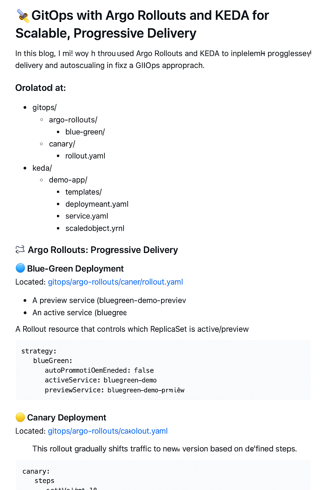

# 🚀 GitOps with Argo Rollouts and KEDA for Scalable, Progressive Delivery

In this blog, I’ll walk through how I used **Argo Rollouts** and **KEDA** to implement **progressive delivery** and **autoscaling** in a Kubernetes-native way using a GitOps approach.



## 🧠 Key Concepts

- **Argo Rollouts**: for blue/green and canary deployments
- **KEDA**: for Kubernetes event-driven autoscaling
- **GitOps**: Git as the single source of truth

## 📂 Project Structure

```
gitops/
├── argo-rollouts/
│   ├── blue-green/
│   │   └── rollout-bluegreen.yaml
│   └── canary/
│       └── rollout-canary.yaml
├── keda/
│   └── demo-app/
│       ├── values.yaml
│       └── templates/
│           ├── deployment.yaml
│           ├── scaledobject.yaml
│           └── service.yaml
```

## 🔧 Blue/Green Rollout

The `bluegreen-demo` uses `autoPromotionEnabled: false` to control traffic shifts.

```yaml
strategy:
  blueGreen:
    autoPromotionEnabled: false
    activeService: bluegreen-demo
    previewService: bluegreen-demo-preview
```

## 🌊 Canary Rollout

Canary steps with progressive weights:

```yaml
steps:
- setWeight: 20
- pause: {}
- setWeight: 40
- pause: {duration: 10}
...
```

## 📈 KEDA Autoscaler

KEDA ScaledObject watching an external metrics API:

```yaml
triggers:
- type: metrics-api
  metadata:
    targetValue: "1"
    url: http://sample-app-service.demo.svc.cluster.local:8000/
    valueLocation: "place.demoes.count"
```

## 🚀 Summary

You now have:
- **Progressive delivery** with Argo Rollouts
- **Dynamic autoscaling** using KEDA
- Fully driven by **GitOps** for safe, repeatable deployments

Happy shipping 🚢
